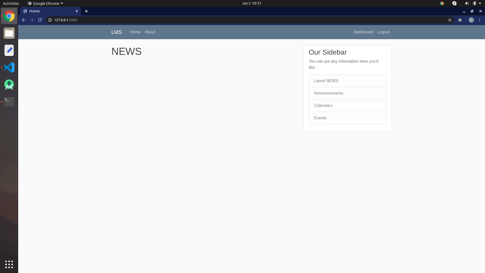
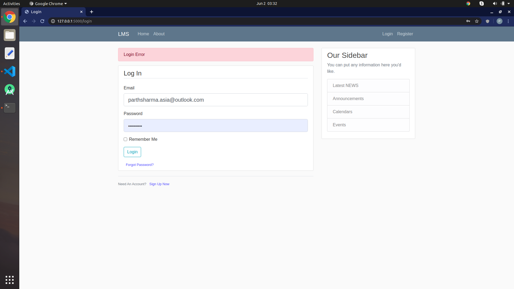
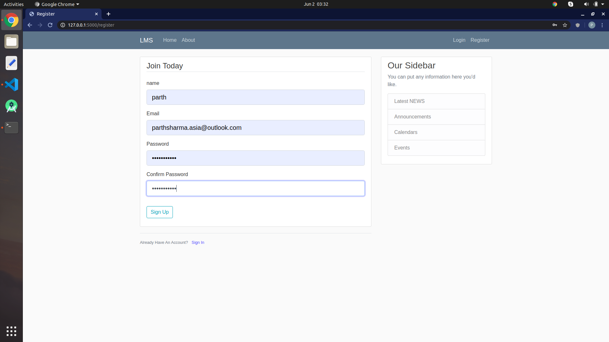
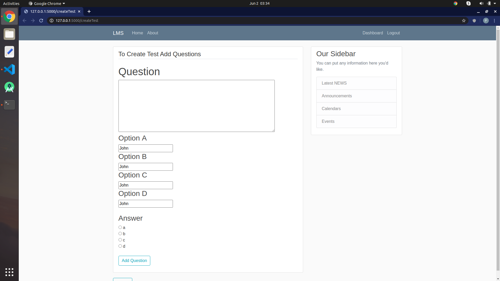
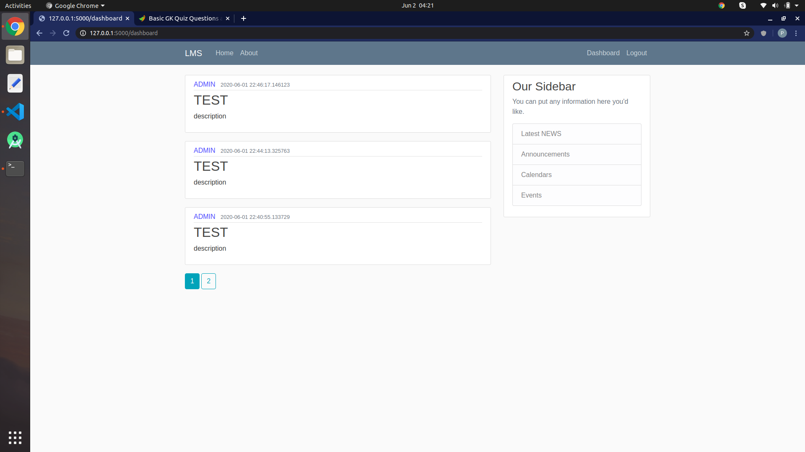
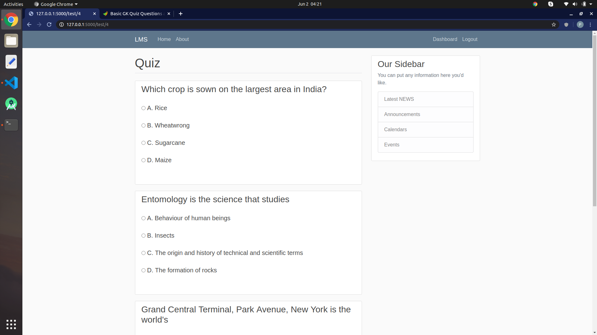
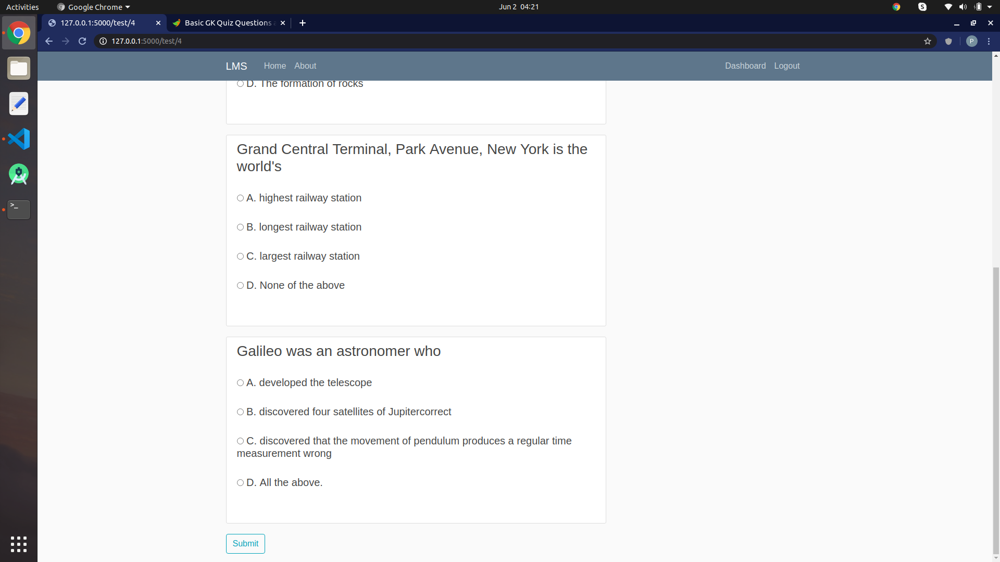
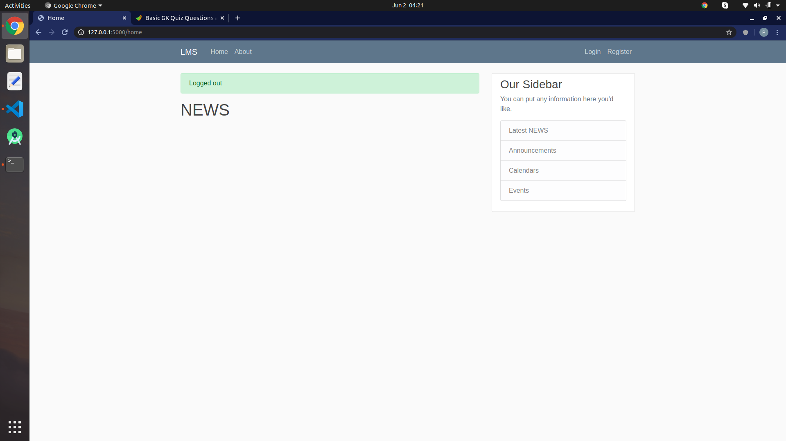

# LMS

a learning management syastem tha lets you host quizzes for your organization you can host different content using this flask website and can also host daily news about your organization.
--------------

External Libraries and Packages
--------------------------------

The intent of this project is to give you practice writing raw Python code using the necessary classes provided by the Flask framework; therefore, the external libraries are not extensively used.
Website uses Flask dependencies

bcrypt==3.1.7
cffi==1.14.0
click==7.1.2
Flask==1.1.2
Flask-Bcrypt==0.7.1
Flask-SQLAlchemy==2.4.3
Flask-WTF==0.14.3
itsdangerous==1.1.0
Jinja2==2.11.2
MarkupSafe==1.1.1
pycparser==2.20
six==1.15.0
SQLAlchemy==1.3.17
Werkzeug==1.0.1
WTForms==2.3.1

API Call
---------

The api can be used to host test on different websites.

Layout Best Practices
---------------------

The code adheres to all of the following best practices:
- Text sizes are defined in sp
- Lengths are defined in dp
- Padding and margin is used appropriately, such that the views are not crammed up against each other.

Text Wrapping
--------------

Information displayed on list items is not crowded.

Runtime Errors
--------------

The code runs without errors.

#Code Readability
-----------------

Naming conventions
------------------

All variables, methods, and resource IDs are descriptively named such that another developer reading the code can easily understand their function.

Format
------

The code is properly formatted i.e. there are no unnecessary blank lines; there are no unused variables or methods; there is no commented out code.
The code also has proper indentation when defining variables and methods.

